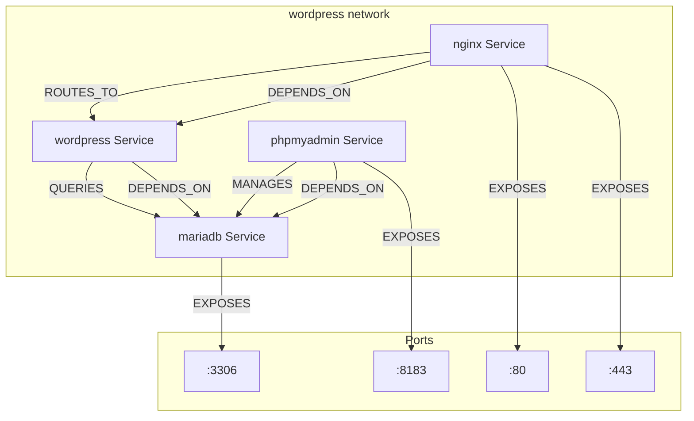
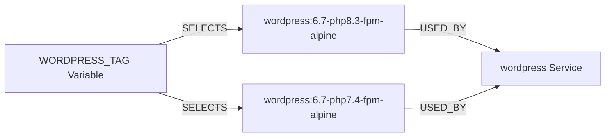
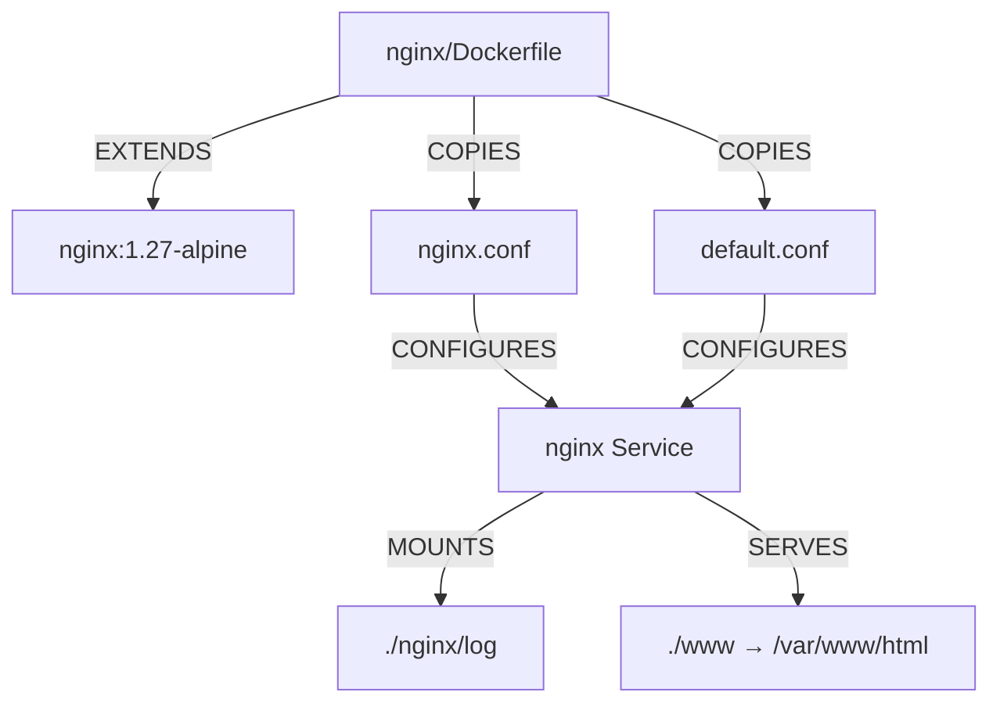
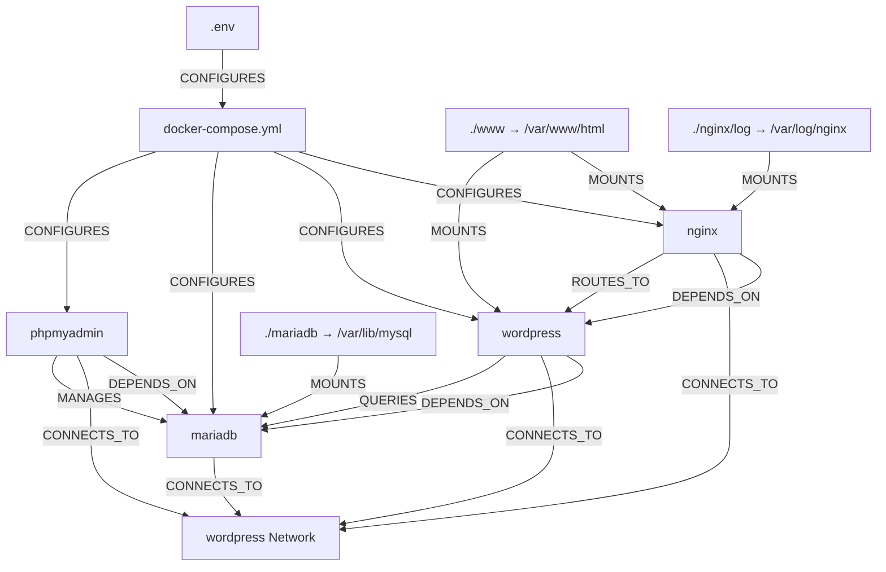
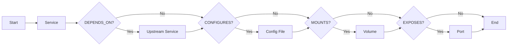

# Graph Model

This project uses Graphify thinking. Everything is represented as nodes and relationships.

## Node Types

| Node Type | Examples | Description |
|-----------|----------|-------------|
| `Service` | nginx, wordpress, mariadb, phpmyadmin | Docker Compose service |
| `Image` | wordpress:6.7-php8.3-fpm-alpine, nginx:1.27-alpine | Pre-built Docker image |
| `ConfigFile` | nginx.conf, default.conf, docker-compose.yml | Configuration artifact |
| `Volume` | ./www, ./mariadb, ./nginx/log | Persistent or bind-mounted data |
| `Network` | wordpress | Docker bridge network |
| `Port` | 80, 443, 3306, 9000, 8183 | Exposed or internal port |
| `Tool` | wp-cli | CLI tool available in a service |
| `Variable` | WORDPRESS_TAG, NGINX_HTTP_PORT | Environment variable |

## Relationship Types

| Relationship | From | To | Description |
|-------------|------|----|-------------|
| `DEPENDS_ON` | Service | Service | Service depends on another service |
| `CONNECTS_TO` | Service | Network | Service is attached to a network |
| `MOUNTS` | Volume | Service | Volume is mounted into a service |
| `CONFIGURES` | ConfigFile | Service | Config file defines service behavior |
| `EXPOSES` | Service | Port | Service listens on a port |
| `EXECUTES` | Service | Tool | Tool is available inside a service |
| `SELECTS` | Variable | Image | Env var selects which image tag to use |
| `ROUTES_TO` | Service | Service | Service routes traffic to another |
| `QUERIES` | Service | Service | Service queries another for data |
| `MANAGES` | Service | Service | Service provides admin UI for another |

## Service Graph

## Image Selection Graph (PHP Versioning)

## Nginx Graph

## Full Dependency Graph

## Reading the Graph

When analyzing a change:

1. **Identify the changed node** (config, service, volume, etc.)
2. **Follow outgoing relationships** to find what is affected
3. **Follow incoming relationships** to find what depends on it
4. **Document the impact chain** before implementing

## Change Impact Analysis

| Change | Follow Relationships | Verify |
|--------|---------------------|--------|
| Modify `nginx.conf` | CONFIGURES → nginx → DEPENDS_ON → wordpress | `nginx -t`, reload |
| Change `WORDPRESS_TAG` | SELECTS → wordpress image → DEPENDS_ON → mariadb | `docker compose pull wordpress` |
| Change MariaDB port | docker-compose.yml → CONFIGURES → mariadb → EXPOSES → port | `docker compose config` |
| Modify .env variable | CONFIGURES → docker-compose.yml → all services | `docker compose config` |
